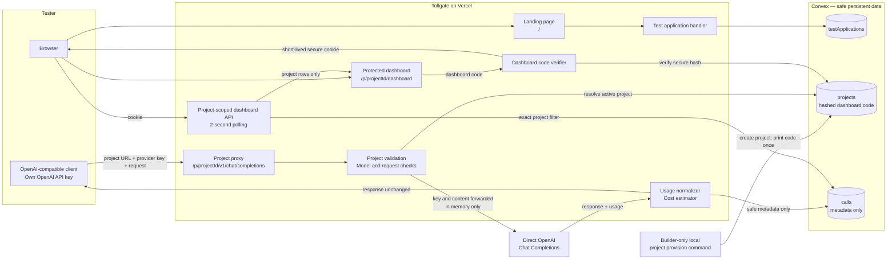
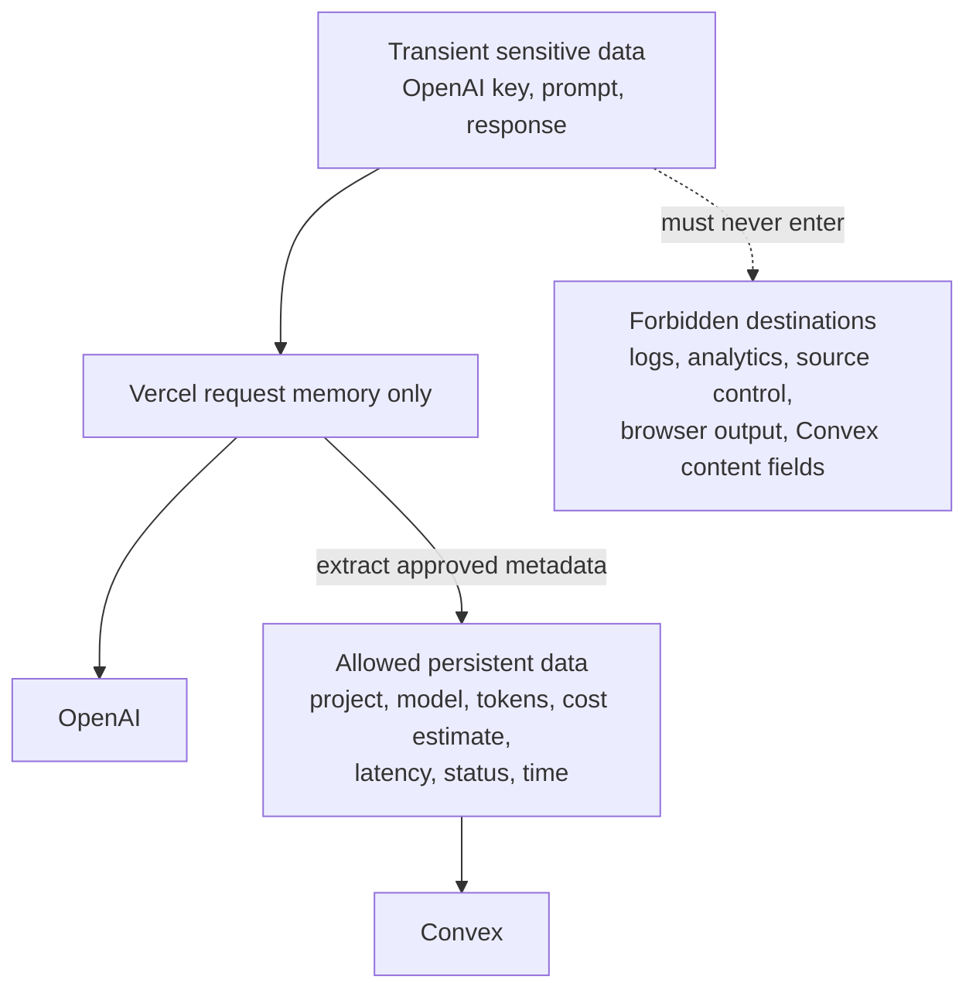
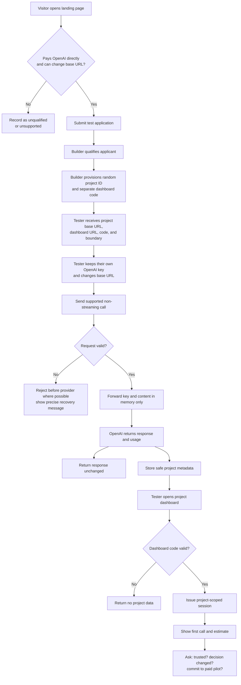

# M1 Architecture and Flow Map

## System architecture

## Security boundary

## Trust model

| Item | Purpose | Storage |
|---|---|---|
| Tester OpenAI key | Pays for the provider call | Tester client and request memory only |
| Project ID | Routes writes to one project | Plain value in project record and base URL |
| Dashboard access code | Protects project reads | Plain value shown once; only secure hash stored |
| Dashboard session cookie | Allows short-lived dashboard reads | Secure, HTTP-only, same-site browser cookie |
| Provider response content | Returned to the client | Request memory only |
| Call metadata | Powers the meter | Project-scoped Convex record |

The project ID is not a read secret. Someone who knows it and has their own valid OpenAI key could add calls to that project's ledger. This is accepted only for the M1 non-production test. The separate dashboard code protects reads.

## User-flow map

## Screen and route map

| Surface | Actor | Purpose | P0 state |
|---|---|---|---|
| `/` | Visitor | Understand promise and apply | Hero, trust line, four-field form |
| Builder-only provision command | Builder | Create project and print access once | Local command; not a public admin page |
| `/p/{projectId}/v1/chat/completions` | Client | Send tester-funded request | Non-streaming direct OpenAI only |
| `/p/{projectId}/dashboard` | Tester | Unlock and view project cost | Code gate, empty state, latest call, totals |
| Project dashboard data API | Dashboard | Return only authorized project rows | Server-verified session; two-second polling |

## M1 deployment units

- One Next.js application on Vercel: landing page, proxy, dashboard access, and project-scoped data API.
- One Convex deployment: applications, projects, and safe call metadata.
- One public GitHub repository.
- One direct OpenAI upstream provider.
- No OpenRouter dependency and no native Anthropic, Gemini, or Meta integration.

## Product layer map

| Layer | Tollgate M1 | Essential today? |
|---|---|---|
| Frontend | Landing page, tester form, dashboard-code screen, empty dashboard, totals, latest-call table, setup block, error states | Yes |
| Backend | Application handler, manual project provisioning, project validation, pass-through proxy, usage extraction, pricing, dashboard session, project-scoped data API | Yes |
| Database | `testApplications`, `projects`, and safe `calls` metadata in Convex | Yes |
| Integrations | Direct OpenAI for model calls, Convex for persistence, Vercel for hosting, GitHub for the public repository | Yes |
| Payments | None | No; use a written paid-pilot commitment as revenue evidence |
| Notifications | None | No; builder contacts testers manually |
| Additional model providers | OpenRouter, Anthropic, Gemini, and hosted Meta models | No; parking lot |

## Architecture acceptance

The architecture passes only when:

1. A tester-funded call succeeds through the project route.
2. No key, prompt, or response is found in Convex or application logs.
3. The call appears only under the resolved project.
4. Missing or wrong dashboard access reveals no data.
5. A Project A session cannot read Project B.
6. Unsupported requests are rejected before provider spend whenever possible.
